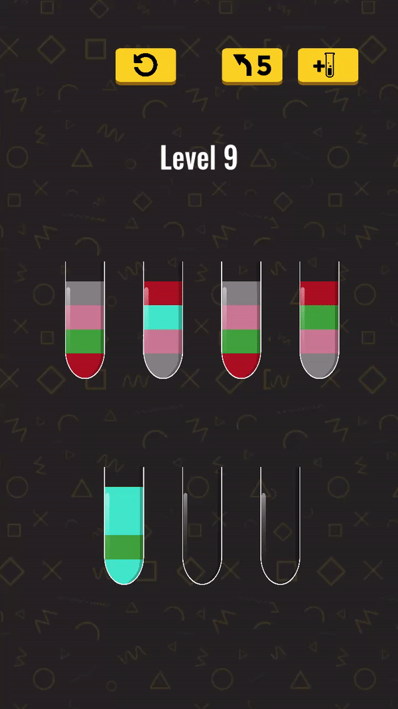

### Water Sort Puzzle Game
This game is a puzzle game where we try to collect the same colors in the same bottles.
## Game Goal
Collect the same colors in the same bottles.
## Design Details
After tutorial *(after level 4)* levels generating. I can't design levels so I decided to write a level generator.
The generator have conditions like how many bottle should have in level, which color will be create, can create same color in a bottle and so on. 
After level generator I needed to make sure the generated levels were solvable. I coded a solver which is using [Depth First Search Algorithm](https://en.wikipedia.org/wiki/Depth-first_search). If level cannot solve after 20.000 move,
generator creating new level.For controlling level generator status i coded level generator controller for make game balance.

Since all these events take place in another thread, there is no load screen or interruption in the game flow. Dunctions that run on the other thread sometimes needed to be processed in the main thread, so I used [Dispatcher Desing Pattern](https://www.what-could-possibly-go-wrong.com/the-dispatcher-pattern/)

## In Game GIFs

